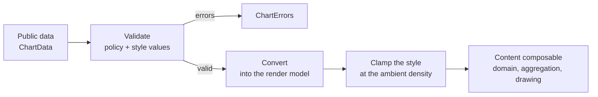

# Entry Seam and Chart Policy

A chart takes public data, checks it, wraps it in the render model, clamps its style, then draws.
Everything up to the clamp is written once, in `ChartEntry` in `charts-core`. A chart declares one
`ChartSpec` object saying which checks apply to it and how it answers them.

## The pipeline



| Step | What happens | Where it runs |
| --- | --- | --- |
| Validate | Compares the data against the policy and against the values the style holds | Seam |
| Convert | Wraps the validated data in the render model; only stacked bar changes its shape | Seam, through the spec's `convert` |
| Clamp | Puts style values into their drawable ranges at the current density | Seam, through the spec's `clamp` |
| Draw | Picks a domain, aggregates, resolves colors, lays out header, plot and legend, and draws | The chart's content composable |

Everything up to and including the clamp is the seam. Each step is remembered against the values it
reads, so it runs once per data, style, title or density change rather than on every recomposition.

Clamping is last rather than in stage order because invalid data returns before it: nothing is
clamped for a chart that is about to render errors.

The content composable holds the draw step because drawing works in pixels. The **domain and the
normalization are not in that category** — neither needs a measured size — so they could be hoisted
to the seam too, and whether they should be is an open question. The catch is caller-chosen range
bounds: line resolves its domain from `style.range`, so a caller can set a domain the data falls
outside, and the clamp in `normalizeValue` is what keeps the draw inside the plot. Validation Errors
has that case. Style Clamping has what clamping decides.

A chart that has one public composable lets its entry call the content directly. A chart with two
public composables passes the content in as a lambda, so both share one entry — line is the case, and
`LineChartEntry` takes a content lambda because `LineChartImpl` and `LiveLineChartImpl` differ.

## The spec

`ChartSpec` is the whole of a chart's input declaration. One object per chart:

```kotlin
object LineChartSpec : ChartSpec<LineChartStyle> {
    override val policy = ChartPolicy(
        minValues = ValidationErrors.MIN_VALUES,
        allowNegative = true,
        stacksValues = false,
        singleSeries = false,
        hasAxis = true,
        hasFixedRange = true,
        colorsMatch = { data -> data.series.size },
    )

    override fun validationInputs(style: LineChartStyle) =
        ChartValidationInputs(
            colorCount = style.line.colors.size,
            rangeMin = style.range.min,
            rangeMax = style.range.max,
            xLabels = style.axis.xLabels,
            yLabels = style.axis.yLabels,
        )

    override fun clamp(style: LineChartStyle, density: Density) = style.clamp(density)
}
```

and the entry is one call:

```kotlin
ChartEntry(
    spec = LineChartSpec,
    data = data,
    style = style,
    errorStyle = style.chartContainerStyle,
    content = content,
    modifier = modifier,
    title = title,
)
```

`LineChart` and `LiveLineChart` share both, and differ only in what they draw below the seam. The
four values that have to change together — policy, style mapping, clamping, conversion — are one
declaration, so they cannot drift apart, and a chart that has two public composables states them
once.

`clamp` is the one member no chart varies: all six specs delegate to the `clamp(density)` extension
next to their own style, because the rules belong with the values they describe and the seam must not
know any style. It stays on the spec so a chart that draws another chart's style has somewhere to map
between the two.

## The policy

`ChartPolicy` answers one question: which checks apply.

| Field | Turns on |
| --- | --- |
| `minValues` | The fewest values a point needs |
| `allowNegative` | Negative values reported as errors |
| `stacksValues` | Sums across the series at an index that overflow reported as errors |
| `singleSeries` | `validateSingleSeries`, which matches the color count against the value count |
| `hasAxis` | The X and Y axis label checks |
| `hasFixedRange` | The range-bound check |
| `colorsMatch` | How many colors the style must set; null defers to the value count on a `singleSeries` chart, and skips the check otherwise |

A policy cannot read a style, so the style values travel beside it in `ChartValidationInputs`: the
color count, the range bounds, and both axis label styles. Each chart maps its own style onto them in
its spec's `validationInputs`, next to its entry — `LineChartSpec.validationInputs` in
`LineChartEntry.kt`.

The seam runs the enabled checks in one order: data shape, then range, then axis labels. Two charts
with the same policy report the same problems in the same sequence.

The checks live in `DataValidation.kt` and `AxisLabelValidation.kt`. Validation Errors lists what
each one reports.

Neither type has a default value, and no parameter of a check function has a default either. A chart
writes `colorCount = 0` or `rangeMin = null` to say it has no colors and no range. Leave a field out
and the build fails.

A policy that declares an axis must supply both label styles. A missing pair is reported as an error:
an axis with nothing to validate would draw unclamped labels and report nothing about them.

### When the color count depends on the data

`colorsMatch` is a function, so a chart that cannot state the expected count as a constant says how
it derives it. Radar is the case that needs it: one series cannot be mis-coloured, so the check runs
only when the data holds more than one.

```kotlin
colorsMatch = { data -> data.series.size.takeIf { count -> count > 1 } }
```

A rule that returns null skips the check for that data. The alternative — reporting `colorCount = 0` —
makes "this chart has no colors" mean "this chart declines to check", which is a rule hiding in a
style value.

A `singleSeries` policy always matches its value count, so it declares `colorsMatch = null`: it has
no rule of its own to state. Bar, histogram and pie write `null` so that their rows read the same way
as every other chart's, and a reader does not have to know the rule to compare two rows. The null says
"counted against the value count", not "declined to check", so it cannot be mistaken for a chart that
skips the color check.

## The policy table

Each chart has a row here and a row in `ChartPolicyConformanceTest`, in the `charts` module. Both are
written by hand and change in the same commit.

| Chart | `minValues` | `allowNegative` | `stacksValues` | `singleSeries` | `hasAxis` | `hasFixedRange` | `colorsMatch` |
| --- | --- | --- | --- | --- | --- | --- | --- |
| Line | 2 | yes | no | no | yes | yes | series count |
| Bar | 2 | yes | no | yes | yes | yes | value count |
| Histogram | 2 | no | no | yes | yes | yes | value count |
| Radar | 3 | yes | no | no | no | no | series count, only with more than one series |
| Stacked bar | 2 | no | yes | no | yes | no | series count |
| Stacked area | 2 | no | yes | no | yes | no | series count |
| Pie | 2 | no | no | yes | no | no | value count |
| Ring gauge | 1 | yes | no | yes | no | yes | value count |

Every chart is on the seam. Bar and histogram draw the same plot, so they share
`BarChartInternalPlot`. Their specs differ in the policy — histogram forbids negative bin heights —
and their entries pass the shared plot the same arguments apart from a histogram test tag.

`convert` has a default implementation that passes the data through, so a chart whose render model
is the caller's own data does not write one. **Stacked bar is the only chart that overrides it**,
because it stacks segments and so transposes to one series per bar.

Moving a chart onto the seam means writing `internal/<Name>ChartEntry.kt` with the chart's spec —
policy, style values, clamping and conversion — pointing the public composable at it, and deleting the
validation, clamping and conversion it used to do. The seam runs those steps in the same order, so
the chart behaves the same. One chart per change; the module's tests and the screenshot baselines show
whether anything moved.

The public composable keeps what is not an input stage: the selection lifecycle, and the layout. The
selection index is resolved before the seam, because it counts the public data rather than the render
model.

## Pie names its values by category

Pie is one series whose values are the slices, so it declares `singleSeries` and its categories are
the slice names. It draws no Cartesian axis and formats its readouts from its own helper, so it
declares `hasAxis` and `hasFixedRange` off. It states no `colorsMatch`, because `singleSeries`
already counts its colors against the value count, like bar's and histogram's.

Empty categories are not an error for any chart, pie included. A chart with an X axis drops its
labels and keeps the axis; a pie drops its legend and keeps the slices, and a selected slice with a
blank category falls back to the chart title. See Pie Chart for what a pie shows without names.

## Adding a check

A message goes in `ValidationErrors` and the check goes in `DataValidation.kt`. Charts write no
message text and no check of their own.

A check that applies to every chart calling a function goes into that function. A check that applies
to some charts gets a `ChartPolicy` field, read in `ChartPolicy.errorsFor`. A chart that has not
declared the field keeps running the older check, so the field and the behaviour it stands for move
in the same commit.

## Tests

| Behavior | Tests |
| --- | --- |
| A policy field turns on the check it names | `ChartPolicyTest` in `charts-core` |
| Invalid data never reaches content, and clamping runs at the ambient density | `ChartEntryTest` in `charts-core` |
| Each declared policy matches its row | `ChartPolicyConformanceTest` in `charts` |
| A chart shows its errors for invalid input | Each chart's own tests |

`charts-core` cannot see the chart modules' specs without a test dependency that inverts the
dependency direction, so the table's test lives in the umbrella `charts` module, which already
depends on every chart. The five scalar fields are compared by equality; `colorsMatch` is compared
by asking each policy what it returns for one series and for two.

That test pins the table against the declarations, not against the codebase. It cannot notice a
chart that has a spec and no row, because its chart list and its expectation are written side by
side in one file — a new chart has to be added to both by hand.
