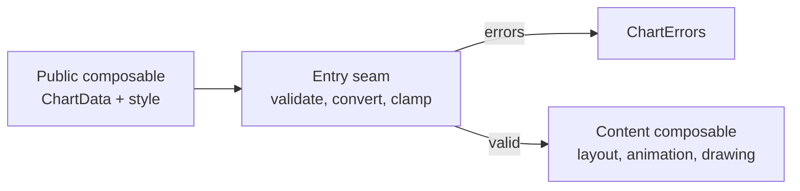

# How Charts Work Inside

Notes on how the charts work inside, mostly the shared code in `charts-core`, for anyone changing
them.

A chart checks its data and style at a shared entry point in `charts-core`, then hands them to a
content composable that lays out, animates and draws.

## Pages

| Topic | Page | What it covers |
| --- | --- | --- |
| The whole path | [Pipeline and Stage Ownership](pipeline.md) | The pipeline stages and where each one belongs. |
| | [Entry Seam and Chart Policy](entry-seam.md) | The shared entry point and how a chart declares its checks. |
| Input and style | [Validation Errors](validation-errors.md) | When a chart shows errors instead of drawing. |
| | [Style Clamping](style-clamping.md) | How out-of-range style values are corrected. |
| | [Style Defaults](style-defaults.md) | Where style defaults live and how factories use them. |
| Drawing | [Rendering and Animation](rendering.md) | Drawing, animation and the compact view of the Cartesian charts. |
| | [X-Axis Labels](x-axis-labels.md) | How X-axis labels are spaced and placed. |
| | [Y-Axis Labels](y-axis-labels.md) | How Y-axis ticks and labels are placed. |
| | [Legend and Selection](legend.md) | When the legend and title appear and what they show. |
| Code layout | [Naming and File Structure](naming.md) | How chart composables and files are named. |

Known issues and limits of these pages are in the Known Issues section.
