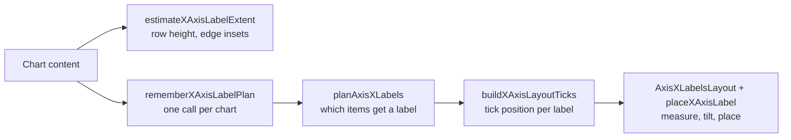

# X-Axis Labels

Bar, histogram, stacked bar, stacked area, line, and live line charts share one X-axis label
pipeline in `charts-core`. Labels sit on every N-th item counted from the first, each label is
centered on its tick, and a label is drawn whenever its tick is inside the plot.

## Pipeline



| Step | Function | File |
| --- | --- | --- |
| Row height and edge insets | `estimateXAxisLabelExtent`, `xAxisLabelRowHeightPx`, `xAxisLabelEdgeInsetPx` | `AxisHelpers.kt`, `AxisLabelLayouts.kt` |
| Plan and ticks in one call | `rememberXAxisLabelPlan` | `AxisXPlanner.kt` |
| Labeled items | `planAxisXLabelStride`, `planAxisXLabels` | `AxisXPlanner.kt` |
| Tick positions | `buildXAxisLayoutTicks` | `AxisLabelLayouts.kt` |
| Drawing | `AxisXLabelsLayout`, `placeXAxisLabel` | `AxisLabelLayouts.kt`, `AxisHelpers.kt` |

All files are in `charts-core/src/commonMain/kotlin/io/github/hdcharts/core/internal/axis/`.

Every chart calls `rememberXAxisLabelPlan` and draws the returned ticks. It re-plans the labeled
items and tick positions as the chart scrolls. The step depends only on the layout and is
remembered apart from the scroll position, so scrolling reuses it and labels stay on the same items.

## Labeled Items

`planAxisXLabels` puts labels on one grid: every `step`-th item, counted from item 0. Labels are
always evenly spaced, and in dense mode they stay on the same items while the chart scrolls.

`planAxisXLabelStride` picks the step. It starts from the densest grid that keeps labels at least
the [minimum spacing](#minimum-spacing) apart and shows at most `AxisLabelStyle.maxCount` labels.
By default `maxCount` is null, so the grid is as dense as the spacing allows and wider charts show
more labels. A set `maxCount` is a cap: the chart never shows more labels, and shows fewer when the
spacing does not allow that many.

Without scrolling, a grid that ends on the last item wins when it shows at most one label fewer
than the densest grid. Such a step divides the last index, so the planner checks the divisors of
`itemCount − 1` in that range, which takes about `√itemCount` steps.

While scrolling, the cap applies to each screen and the last item plays no part. A screen draws
every tick within 1 px of a label row that is at most 1 px wider than the viewport after rounding,
so it holds at most `floor((viewport + 3 px) / unitWidth) + 1` ticks. The step is at least that tick
count divided by `maxCount`, rounded up.

| Items | Labeled items with `maxCount = 6` | Why |
| --- | --- | --- |
| 8 | 0, 2, 4, 6 | Every item would be 8 labels. 7 is prime, so only the two end items reach item 7, two labels fewer. |
| 10 | 0, 3, 6, 9 | Ends on the last item for one label fewer than 0, 2, 4, 6, 8. |
| 12 | 0, 2, 4, …, 10 | Six labels. 11 is prime, so only the two end items reach item 11. |
| 21 | 0, 4, 8, …, 20 | Six labels that end on the last item. |
| 30 | 0, 5, 10, …, 25 | 29 is prime, so only every item or the two end items reach both ends. |

With the automatic default, a chart labels every item when all labels fit, and otherwise uses the
densest grid that fits. Without scrolling, the last-item rule still applies: 10 items with a
minimum step of 2 get 0, 3, 6, 9, one label fewer than the densest grid.

### Live Windows

A live line chart drops its oldest point and appends a new one on every update. Its grid counts
from the first point of the whole series, not of the window: `TimelineWindowCounter` in
`LineChartAnimation.kt` counts the points the window has dropped since its data was last replaced,
and `planAxisXLabels` labels window item `i` when `droppedPoints + i` is a multiple of the step. Each
label therefore stays on its point. A sliding window has no fixed last item, so it skips the
last-item rule (`AxisXPlanRequest.isSliding`).

While the line slides, `AxisXLabelsLayout` moves every label by `(1 − progress) × step` through
`tickOffsetPx`, so labels start on their points in the old window and slide with them. The labels
are planned for the new window as soon as it is composed, but the slide starts a frame later, when
the update effect runs. Until then the offset is one full step, because `LineChartContent` keeps the
dropped count of the window the line draws next to the slide state. The offset is read only when
the labels are placed, so the animation re-places labels without recomposing them. The label of
the dropped point disappears as the slide starts, and the label of a new point
appears once its tick is inside the plot.

## Minimum Spacing

`xAxisLabelMinSpacingPx(fontSizePx)` in `AxisHelpers.kt` is the smallest distance between two
label ticks. The planner never puts labels closer than this.

### Why Label Length Does Not Matter

Every label is one line of text tilted by the same angle, so neighboring labels are parallel strips
of text. Parallel strips can touch only across their thickness, the line height, never along their
length.

For two ticks `d` apart, the distance between the two text lines, measured at a right angle to the
text, is `d × sin 34°`. The labels keep a clear gap when that distance is at least one line height
plus the gap:

```text
d × sin(34°) ≥ lineHeight × (1 + gap)
d ≥ lineHeight × (1 + gap) / sin(34°)
```

### Formula

```text
minSpacing = fontSize × 1.2 × (1 + 0.5) / sin(34°) ≈ 3.22 × fontSize
```

| Constant | Value | Meaning |
| --- | --- | --- |
| `AXIS_LABEL_LINE_HEIGHT_FACTOR` | 1.2 | Estimated line height as a share of the font size. |
| `AXIS_LABEL_GAP_FACTOR` | 0.5 | Empty space between neighboring labels, as a share of the line height. The Y axis uses it too. |
| `X_AXIS_LABEL_TILT_DEGREES` | 34 | Label tilt, shared with the placement and the row height. |

All three live in `AxisHelpers.kt`. The font size is `AxisLabelStyle.size` in sp, so the spacing
also grows with the system font scale.

### Values

At the default 11sp label size, the minimum spacing is about 35dp:

| Screen density | Minimum spacing |
| --- | --- |
| 1.0 | 35 px |
| 1.65 (tablet screenshot tests) | 58 px |
| 2.625 (phone screenshot tests) | 93 px |

### How the Planner Uses It

`planAxisXLabels` turns the spacing into the smallest allowed step:
`minStep = ceil(minSpacing / unitWidth)`, kept within 1 and the item count, where `unitWidth` is
the distance between neighboring items. Every step the planner considers is at least `minStep`.

- With the automatic default (`maxCount = null`), the densest step is `minStep`, so labels are as
  dense as the spacing allows.
- With a set `maxCount`, the densest step is the larger of `minStep` and the smallest step that
  shows at most `maxCount` labels. A high `maxCount` cannot push labels closer together.

Without scrolling, the last-item rule may then widen the step.

For example, 12 bars about 26dp apart on a phone give `minStep = 2`, so every other month is
labeled. The same 12 bars about 92dp apart on a tablet give `minStep = 1`, so every month is.

### Public API

The minimum spacing is internal. Apps control label density with:

- `AxisLabelStyle.maxCount`: fewer labels. It cannot add labels past the minimum spacing.
- `AxisLabelStyle.size`: the minimum spacing grows with the text.
- Chart width, bar spacing, and zoom: they change the distance between items.

### Limits

- All label centers sit on one line, so the rule holds for labels of any length: neighbors that
  are `d` apart always have text lines `d × sin 34°` apart.
- The line height is an estimate of 1.2 × font size. Fonts with taller lines, such as many CJK
  fonts, get less room than the formula intends.

### Changing It

- To give labels more or less room, change `AXIS_LABEL_GAP_FACTOR`. This also changes the
  automatic label count on every chart, and the Y-axis tick spacing.
- `AXIS_LABEL_LINE_HEIGHT_FACTOR` also sizes the label row through
  `estimateXAxisLabelExtent`, so changing it moves the plot as well.
- `AxisHelpersTest.xAxisLabelMinSpacingPx_keepsParallelLabelLinesApart` checks the rule. Planner
  tests pass their own spacing, so they do not depend on these constants. Rendered labels move, so
  run `./gradlew updateScreenshots` after a change.

## Placement

`AxisXLabelsLayout` measures each label and places it with `placeXAxisLabel`:

- The label turns 34° around its own center.
- Its center sits on its tick.
- All label centers sit on one line, the middle of the label row below the plot gap. Labels of
  different lengths therefore start and end at slightly different heights, but they never move
  closer to their neighbors.

`buildXAxisLayoutTicks` puts item `i` at `firstTickPx + i × unitWidthPx − scrollOffsetPx`.

| Chart | `items` (sets `firstTickPx`) | `unitWidthPx` |
| --- | --- | --- |
| Bar, histogram, stacked bar | `AxisXItems.Bars(barWidthPx)`: first tick at half a bar width | Bar width plus bar spacing |
| Line, live line, stacked area | `AxisXItems.Points`: first tick at 0 | Distance between points |

## Edges

A label is drawn when its tick is inside the plot, with 1 px of slack for rounding. Labels are
never moved.

Line, live line, and stacked area charts put their first and last points on the plot edges, so
their first and last labels are centered on the edges. The plot moves in from each edge by
`xAxisLabelEdgeInsetPx`: half the width of the longest tilted label, less what the chart content
padding (15dp by default) holds, and on the left also less the Y-axis gutter. The edge labels then
stay inside the chart bounds. Each inset takes at most 20% of the chart width, so very long labels
hang past the chart bounds instead of squeezing the plot. Gestures still cover the insets, so a
touch just past the last point selects it.

Bar, histogram, and stacked bar charts center labels under their bars, half a bar in from each
edge, and do not move the plot in. A long first or last label on narrow bars can reach into the
Y-axis gutter or the chart padding.

While scrolling, a label near either edge may reach past the plot into the gutter or the insets.
`planAxisXLabels` plans one item past the far edge of `visibleRange`, and `placeXAxisLabel` alone
decides which labels are drawn. Scrolling items are at least 1 px wide, so that one item covers the
1 px slack: a tick on the right edge keeps its label when the plot width is rounded up to whole
pixels. `visibleRange` stays exact, because bar charts use it to draw bars.

## Row Height and Edge Insets

`estimateXAxisLabelExtent` estimates the longest label at 0.58 × font size per character and
1.2 × font size per line, tilted 34°. Its `heightPx` is how tall the tilted label is, and its
`halfWidthPx` how far it reaches to each side of its tick. It finds the longest label by length
alone and counts the digits of the item numbers that stand in for blank labels without building
them, so a chart with a million items allocates no label strings.

Charts size the row with `xAxisLabelRowHeightPx`, which adds `AXIS_LABEL_CHART_GAP` (10dp) between
the plot and the labels, and line and stacked area charts size their edge insets with
`xAxisLabelEdgeInsetPx`. `AxisXLabelsLayout` leaves the same gap before centering the labels, so
both live in `AxisLabelLayouts.kt`.

## Tests

| Behavior | Tests |
| --- | --- |
| Step choice, even spacing, scrolling | `AxisXPlannerTest` in `charts-core/src/commonTest` |
| Tick positions, placement, spacing, row height | `AxisHelpersTest` in `charts-core/src/commonTest` |
| Labels centered on bars in rendered charts | `*_xAxisLabels_centeredUnderBars` in `charts-bar` and `charts-stacked-bar` |
| Labels centered on points in rendered charts | `*_xAxisLabels_centeredOnTheirPoints` in `charts-line` and `charts-stacked-area` |
| Long last label drawn and centered at the plot edge | `*_lastXAxisLabel_centeredUnderLastBar` and `*_lastXAxisLabel_centeredOnLastPoint` in the same modules |
| Long first and last labels inside the chart bounds | `*_longEdgeXAxisLabels_stayInsideChartBounds` in `charts-line` and `charts-stacked-area` |
| Live window labels stay on their points and slide with them | `slidingWindow_*` in `LiveLineChartTest` in `charts-line` |

Histogram charts have no rendered label tests of their own: they reuse the bar chart layout.

Label rendering is also covered by the Android screenshot tests. After an intentional visual
change, run `./gradlew updateScreenshots`.

### Brute-Force Checks

The planner functions were compared with plain definitions of their output. Every case matched.

| Function | Compared with | Inputs |
| --- | --- | --- |
| `planAxisXLabelStride` | Walking every step from `minStep`: the first with at most `maxCount` labels on a screen, then, without scrolling, the first step from there that ends on the last item and shows at most one label fewer | 300,000 random requests: 1–399 items, both modes, whole and fractional item widths from 1 to 40 px, viewports from 1 to 800 px, spacing from 0 to 200 px, and caps null, 2–61, 100, 1000, and `Int.MAX_VALUE` |
| `planAxisXLabelStride` with `maxCount = null` | The cost-based planner it replaced | The same 300,000 requests |
| Labels drawn per screen while scrolling | At most `maxCount` labels that `placeXAxisLabel` draws in a label row rounded up to whole pixels, for points and for bars | 10,000 random requests, three offsets per item, including every offset that puts a tick on the near edge of the 1 px slack: about 12 million screens |
| `planAxisXLabels` without scrolling | Every multiple of the step from item 0 through the last item | About 50,000 random requests with 1–399 items, from the same random set as the row below |
| `planAxisXLabels` while scrolling | Every multiple of the step from the first item in `visibleRange` through one item past its last. The plan must also hold every label `placeXAxisLabel` draws, for points and for bars | About 150,000 random requests with 1–399 items, whole and fractional slots from 1 to 40 px, viewports from 1 to 800 px, random spacing and caps, offsets on and between item boundaries, below 0, and past the last item |
| `visibleIndexRange` | Items whose slot `[i × unit, (i + 1) × unit)` touches the viewport `[offset, offset + width]` | 1–25 items with 1, 2, 3, and 10 px slots, at every whole-pixel width and offset, including offsets past the last item |

What the checks show:

- Checking only the divisors of the last index finds the same step as walking every step.
- With `maxCount = null`, every request gets the same step as the cost-based planner, so charts
  that leave `maxCount` unset label the same items as before.
- A cap above the densest grid picks the same step as `null`.
- While scrolling, no screen draws more than `maxCount` labels, even when grid items sit on both
  edges.
- At 10 million items, one step choice takes 0.006–0.03 ms on the JVM, whether the last index is
  prime or has many divisors.
- While scrolling, labels stay on the same items at every offset, and every grid item in
  `visibleRange` gets a label. The only other label is the grid item right after `visibleRange`,
  if there is one. The plan holds every label the layout draws within its 1 px slack, with one
  known gap: a separate check of 200,000 random plans found 29 labels the layout would draw but the
  plan leaves out, all with a tick 0.5 to 1 px left of the plot and items about 1 px wide. Such a
  label hangs almost entirely outside the plot.
- An item that starts exactly on the far edge of the viewport counts as visible, because a line
  point there is on screen. An item that ends exactly on the near edge does not. Past the last
  item, the range holds only the last item.

The step, scrolling, and visible-range checks also run on a smaller, fixed set in every test run:

- `planAxisXLabelStride_matchesSearchOfEveryStride` and
  `planAxisXLabels_scroll_neverDrawsMoreThanMaxCountPerScreen` in `AxisXPlannerTest`
- `planAxisXLabels_scroll_plansEveryDrawnLabelAndAtMostOneGridItemPastViewport` and
  `planAxisXLabels_scroll_fractionalGeometry_plansEveryDrawnLabel` in `AxisXPlannerTest`, the
  second with fractional item and viewport widths
- `visibleIndexRange_smallGrid_coversSlotsTouchingViewport` in `AxisHelpersTest`, over every
  whole-pixel width and offset for up to 12 items

## Known Issues

Known issues and limits are listed in X-Axis Label Issues, in the Known Issues section.
