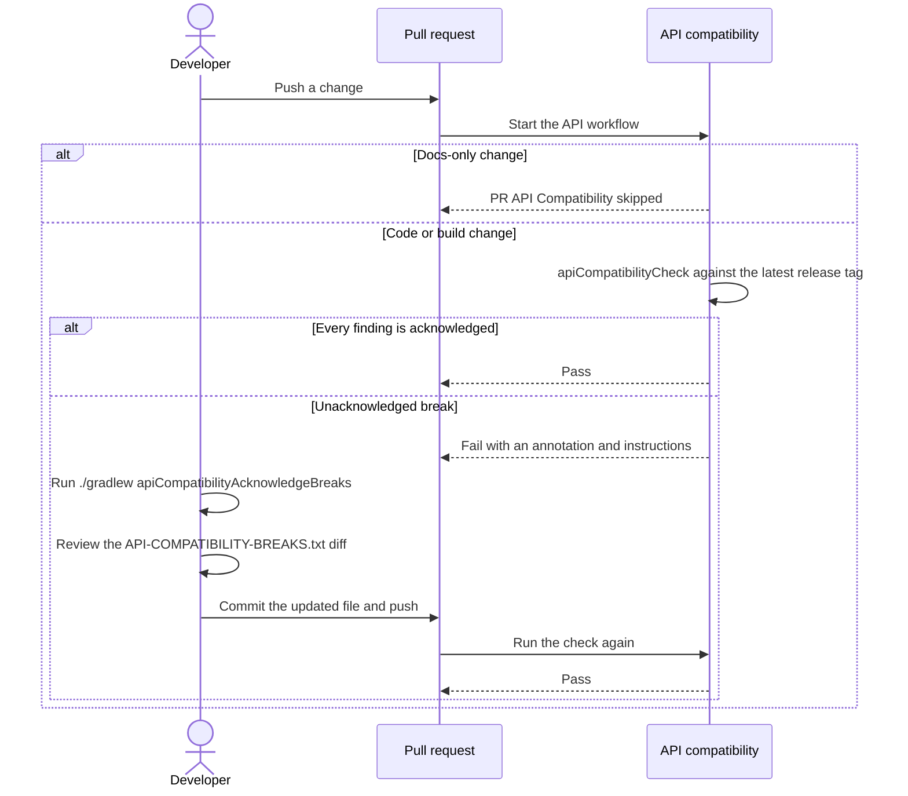

# API Compatibility

Workflows:
- `Pull Request API Compatibility` — [`pull-request-api.yml`](https://github.com/HDCharts/charts/blob/main/.github/workflows/pull-request-api.yml) (pull-request orchestration)
- `API Compatibility` — [`api-compatibility.yml`](https://github.com/HDCharts/charts/blob/main/.github/workflows/api-compatibility.yml) (reusable compatibility check)

## Baseline resolution

`apiCompatibilityCheck` always spans the current release cycle: it resolves
the latest SemVer release tag itself and compares the working tree against
it. A repository with no release tag yet falls back to `origin/main`.

The baseline is fixed on purpose. That span is exactly what the pending
section of `API-COMPATIBILITY-BREAKS.txt` describes, so the findings and the
acknowledgments always cover the same ground. Pointing the gate at some
other ref would break that pairing, so it refuses
`-PapiCompatibilityBaselineRef` and directs you to `apiCompatibilityCompare`
instead.

Both a tag and `origin/main` survive squash-merge, unlike the pinned
pre-merge SHA this replaced — see
[issue #601](https://github.com/HDCharts/charts/issues/601).

## Comparing against an arbitrary ref

To answer "what changed since 2.2.0?", use the investigation task:

```bash
./gradlew apiCompatibilityCompare --no-daemon --continue -PapiCompatibilityBaselineRef=2.2.0
```

It prints the diff and writes the usual reports under
`build/reports/api-compatibility/`, and deliberately leaves both
`API-COMPATIBILITY-BREAKS.txt` and the pass/fail gate alone.

## Acknowledging a breaking change

The gate fails on exactly the detected API breaks that
`API-COMPATIBILITY-BREAKS.txt` leaves unlisted. That file groups entries by
release, one section per version, newest first:

```text
## 3.0.0
charts-line | io.github.hdcharts.charts.style.LineChartStyle | <init>(io.github.hdcharts.charts.style.ChartContainerStyle, boolean) | CONSTRUCTOR_REMOVED

## 2.4.0
charts-pie | io.github.hdcharts.charts.style.PieChartStyle | <init>() | CONSTRUCTOR_REMOVED
```

An entry records only what was accepted. Why it was accepted lives in git:
`git blame` a line to reach the pull request that added it.

Each section heading is the **pending release version**, resolved from Axion
(`currentVersion`, the same mechanism `resolve-release-version.sh` uses) the
moment an entry is acknowledged. Axion advances only when a tag lands, so
every PR in the current cycle resolves the same heading, and the first
acknowledgment after a release is tagged resolves the next version and opens
its own section on top. Released sections stay as a permanent, append-only
history of every accepted break.



1. Push the breaking change. `apiCompatibilityCheck` fails the PR and posts a
   workflow-run annotation with instructions.
2. Run `./gradlew apiCompatibilityAcknowledgeBreaks` locally.
   It re-parses the same japicmp findings and appends one line per finding to
   the section for the pending release version. The module, class, member, and change-kind columns come straight from
   japicmp's own report, so they match what the gate looks for exactly.
3. Review `git diff API-COMPATIBILITY-BREAKS.txt`. This is the human review
   step, since the entries themselves are machine-generated: confirm the task
   caught exactly the breaks you intended, and delete any stray line for a
   change you reverted before commit.
4. Commit the regenerated file in the same pull request and push. The next
   run matches every finding against an acknowledged entry and passes.

Rerunning the task skips lines already present in the section, so
acknowledging twice leaves one entry.

## Release Audit Flow

`Release` runs the same `apiCompatibilityCheck` the PR gate runs, which
already spans the release being cut. Enforcement belongs to the PR gate,
which requires every finding to be acknowledged before a merge reaches
`main`, so this audit stays a non-blocking sanity check: it warns and
continues. A finding here means the PR gate was bypassed, such as by a
direct push or an admin override.

To reproduce the audit locally, run:

```bash
./gradlew apiCompatibilityCheck --no-daemon --continue
```

This file needs no release-time step of its own: each entry's version
heading was already correct the moment it was acknowledged.
