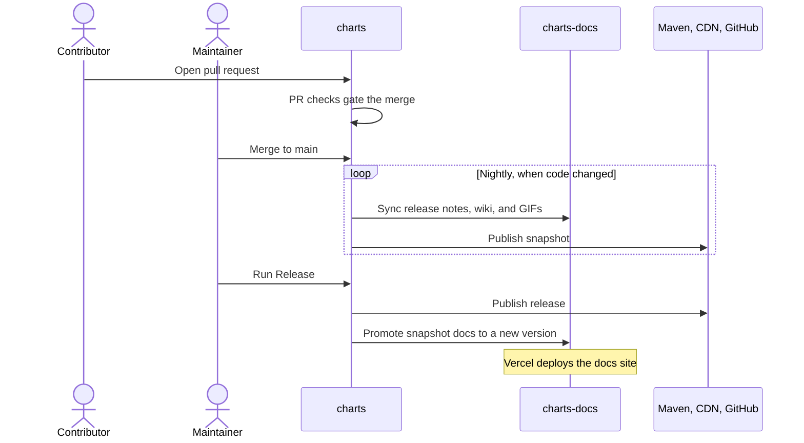

# How HDCharts Ships

Every change goes through the same path: a pull request is checked, merged changes are
published as a nightly snapshot, and a maintainer promotes a tested snapshot to a release.
All workflows live in [`HDCharts/charts`](https://github.com/HDCharts/charts/tree/main/.github/workflows).

| Stage | Workflow | What it publishes |
| --- | --- | --- |
| Pull request | `pull-request.yml`, `pull-request-api.yml`, `pull-request-gif-validation.yml` | Nothing; it gates the merge. |
| Snapshot | `nightly.yml` → `snapshot-release.yml` | Maven snapshot, snapshot API reference and demo, snapshot Android APK, snapshot docs. |
| Release | `release.yml` | Maven release and tag, versioned API reference and demo, release Android APK, versioned docs, GitHub release. |
