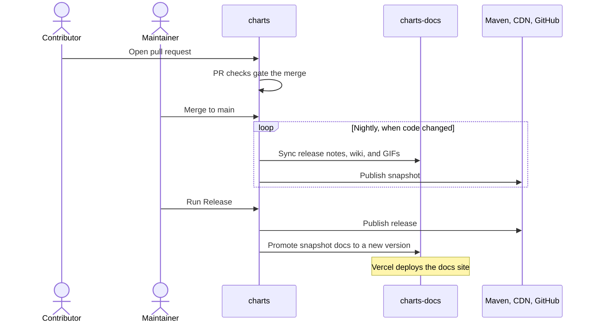

# How HDCharts Ships

Every change goes through the same path: a pull request is checked, merged changes are
published as a nightly snapshot, and a maintainer promotes a tested snapshot to a release.
All workflows live in [`HDCharts/charts`](https://github.com/HDCharts/charts/tree/main/.github/workflows).

```mermaid
sequenceDiagram
  actor Dev as Contributor
  actor Maintainer
  participant C as charts
  participant D as charts-docs
  participant P as Maven, CDN, GitHub
  Dev->>C: Open pull request
  C->>C: PR checks gate the merge
  Maintainer->>C: Merge to main
  loop Nightly, when code changed
    C->>D: Sync release notes, wiki, and GIFs
    C->>P: Publish snapshot
  end
  Maintainer->>C: Run Release
  C->>P: Publish release
  C->>D: Promote snapshot docs to a new version
  Note over D: Vercel deploys the docs site
```

| Stage | Workflow | What it publishes |
| --- | --- | --- |
| Pull request | `pull-request.yml`, `pull-request-api.yml`, `pull-request-gif-validation.yml` | Nothing; it gates the merge. |
| Snapshot | `nightly.yml` → `snapshot-release.yml` | Maven snapshot, snapshot API reference and demo, snapshot Android APK, snapshot docs. |
| Release | `release.yml` | Maven release and tag, versioned API reference and demo, release Android APK, versioned docs, GitHub release. |

## What validates `main`

The pull-request checks. No workflow triggers on `push`, so a merge is never re-validated after it
lands. The nightly snapshot publishes `main` when the last 24 hours brought code changes, and it
runs no test task on the way; `release.yml` runs only when a maintainer starts it.

That makes the pull-request checks the only place where a commit is tested. See
[Pull Requests](pull-requests.md) for the jobs they run and
[Validation Matrix](validation-matrix.md) for what each one covers.
