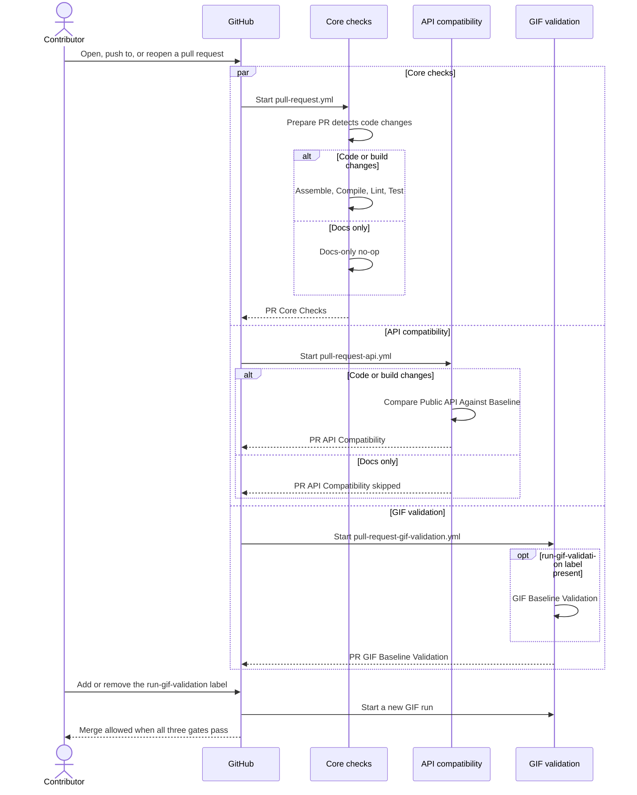

# Pull Requests

Every pull request runs three independent workflows: core checks, API compatibility, and opt-in
GIF validation. Each one checks the immutable merge commit (`github.sha`) of the event that
started it, and each has its own concurrency group, so a new push cancels only its own
older run.



## Workflows

| Workflow | File | Runs on |
| --- | --- | --- |
| Core checks | [`pull-request.yml`](https://github.com/HDCharts/charts/blob/main/.github/workflows/pull-request.yml) | opened, synchronize, reopened |
| API compatibility | [`pull-request-api.yml`](https://github.com/HDCharts/charts/blob/main/.github/workflows/pull-request-api.yml) | opened, synchronize, reopened |
| GIF validation | [`pull-request-gif-validation.yml`](https://github.com/HDCharts/charts/blob/main/.github/workflows/pull-request-gif-validation.yml) | opened, synchronize, reopened, labeled, unlabeled |

## Jobs

| Job | What it does |
| --- | --- |
| `Prepare PR` | Detects code changes with `scripts/ci-has-code-changes.sh` and runs the self-tests of the release scripts. |
| `Assemble` | Runs `./gradlew ciAssemble`. |
| `Compile` | Runs `./gradlew ciCompile`, including the `smoke-line` consumer. |
| `Lint` | Runs `./gradlew ktlintCheck buildSrcKtlintCheck`. |
| `Test` | Runs the JVM, Android, Wasm, and iOS test jobs; see [CI Test Matrix](ci-test-matrix.md). Each job uploads Gradle's HTML and XML reports. |
| `Compare Public API Against Baseline` | Runs `./gradlew apiCompatibilityCheck` against the latest release tag; see [API Compatibility](api-compatibility.md). |
| `GIF Baseline Validation` | Records the docs GIF scenarios on an Android emulator and compares them with `gif-baselines`. |

## Merge gates

The `protect main` ruleset requires three final gates:

```text
PR Core Checks
PR API Compatibility
PR GIF Baseline Validation
```

- **PR Core Checks** fails unless `Prepare PR` and every core check succeed.
- **PR API Compatibility** fails unless the API check succeeds. On a docs-only pull request it is
  skipped, and GitHub treats a skipped required check as passing.
- **PR GIF Baseline Validation** always reports. It passes when the `run-gif-validation` label is
  absent, and it requires GIF validation to succeed when the label is present.

## Docs-only pull requests

`scripts/ci-has-code-changes.sh` treats documentation, release notes, agent guidance, and
repository metadata as non-code changes. For those pull requests, the core and API workflows run
a `Docs-only no-op` job instead of their real validation.

GitHub shows both paths in every run. A code-changing pull request therefore shows a skipped
`Docs-only no-op` row next to the real job; that row is the inactive path, not a signal that the
change was treated as docs-only.

## GIF validation

Add the `run-gif-validation` label to opt a pull request into GIF validation. The workflow runs on
every label change, not only this one, and a new run cancels any run still in progress for that
pull request. Adding an unrelated label during a GIF validation restarts it.

The GIF size and emulator window are set in `validate-gifs.yml` and
`sample/androidApp/build.gradle.kts`; the comments there explain how the two match.

## Fork security

All pull-request workflows run on `pull_request` with read-only permissions, because that is
where untrusted pull-request code is checked out and executed. Do not move build or test steps
to `pull_request_target`; that event has write access.

## Troubleshooting

- **The pull request cannot merge:** compare the required check names in the `protect main`
  ruleset with the names on the pull request's checks page.
- **Tests fail:** open the failing `PR Test` job and download its test-report artifact.
- **API compatibility fails:** if the break is intentional, run
  `./gradlew apiCompatibilityAcknowledgeBreaks` and commit the updated
  `API-COMPATIBILITY-BREAKS.txt` in the same pull request. Acknowledging a break does not hide
  unrelated Gradle errors.
