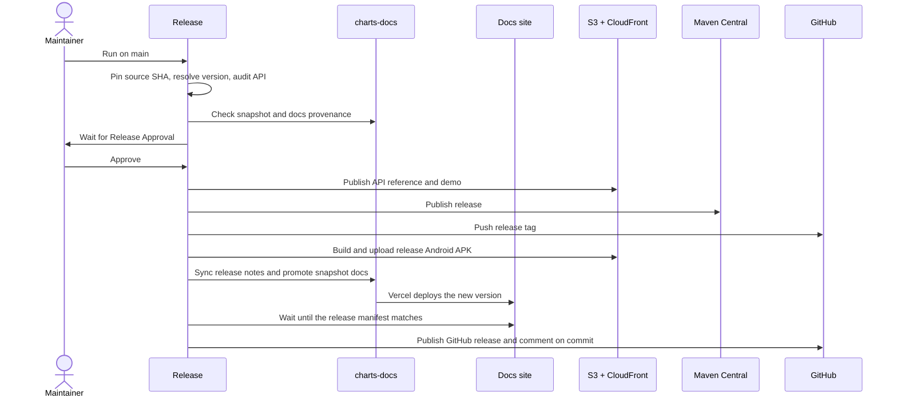

# Release

Workflow: [`release.yml`](https://github.com/HDCharts/charts/blob/main/.github/workflows/release.yml)

Before running this workflow, complete the
[Release Checklist](https://github.com/HDCharts/charts/blob/main/docs/release/release-checklist.md).

Every job builds from the source SHA pinned in the first step, so all published artifacts come
from the same commit.

## Validation

- The release version comes from Axion. If the release tag already exists, the workflow fails
  before publishing anything.
- The release commit must already have a published snapshot: the snapshot manifest in
  `charts-docs` has to match the release version and source SHA.
- If `charts-docs` already has docs for this version, they must come from the same source SHA.
- The API audit runs `apiCompatibilityCheck` and only warns. Breaks are enforced on pull
  requests; see [API Compatibility](api-compatibility.md).

## Publishing

`Release` is the only publishing workflow you start by hand. It waits for the protected
`Release Approval` environment before anything is published.

The optional `replace_static_assets` input replaces pre-release API and demo files for the
resolved version. Leave it off for normal releases.

After the Android build, the workflow promotes the snapshot docs in `charts-docs` to a new
versioned docs folder, syncs the release notes, and waits until the public site serves that exact
docs commit. The GitHub release is published last, with highlights built from the release notes.
