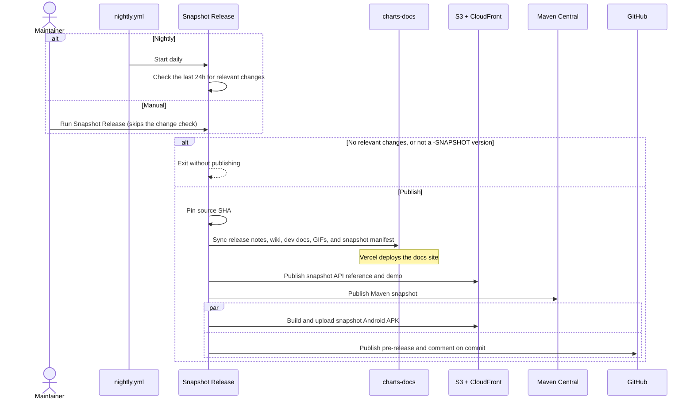

# Snapshot

Workflow: [`snapshot-release.yml`](https://github.com/HDCharts/charts/blob/main/.github/workflows/snapshot-release.yml),
started nightly by [`nightly.yml`](https://github.com/HDCharts/charts/blob/main/.github/workflows/nightly.yml)

## When it runs

The nightly run publishes only when commits from the last 24 hours touch something that affects
a snapshot. Documentation-only changes do not trigger a snapshot by themselves; they go out with
the next snapshot that does.

To publish without waiting, run **Snapshot Release** manually. A manual run skips the change
check, but it still publishes nothing when the Axion version is not a `-SNAPSHOT`, for example
right after a release tag.

To sync only the docs, run the **Snapshot Docs** workflow manually.

## What it syncs

- `release-notes/<version>`, named without the `-SNAPSHOT` suffix, so snapshot pages show the
  notes that will ship with the release. A missing folder does not block a snapshot.
- `docs/wiki` into the snapshot docs in `charts-docs`, except `docs/wiki/dev`, which goes to the
  unversioned dev docs.
- GIF baselines from `gif-baselines` into the snapshot docs assets. A release carries them into
  its versioned docs.
- A snapshot manifest with the version and source SHA. A release requires this manifest to
  match its own source SHA.

Every publishing job, including the Android build, checks out the pinned source SHA.
